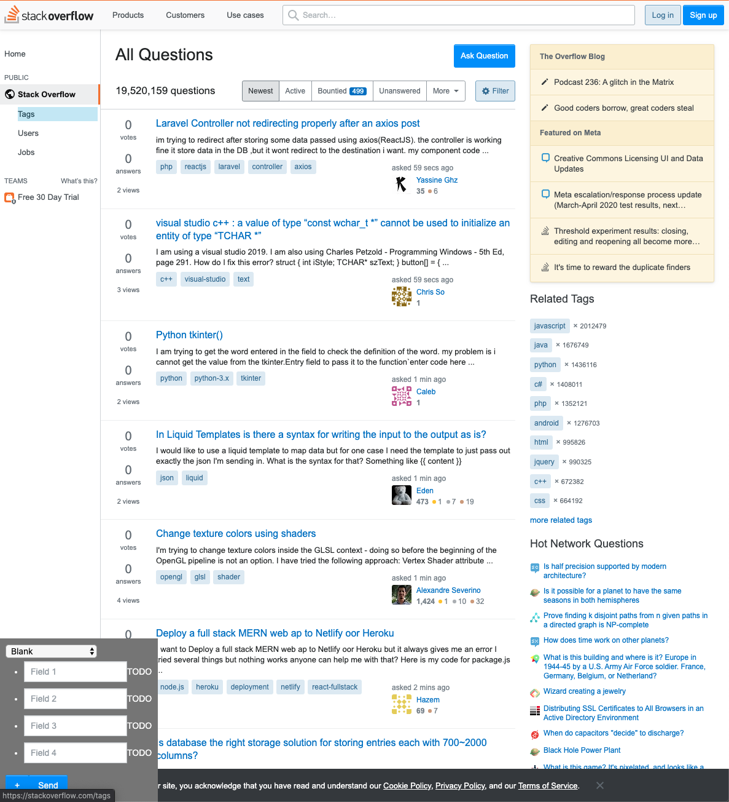
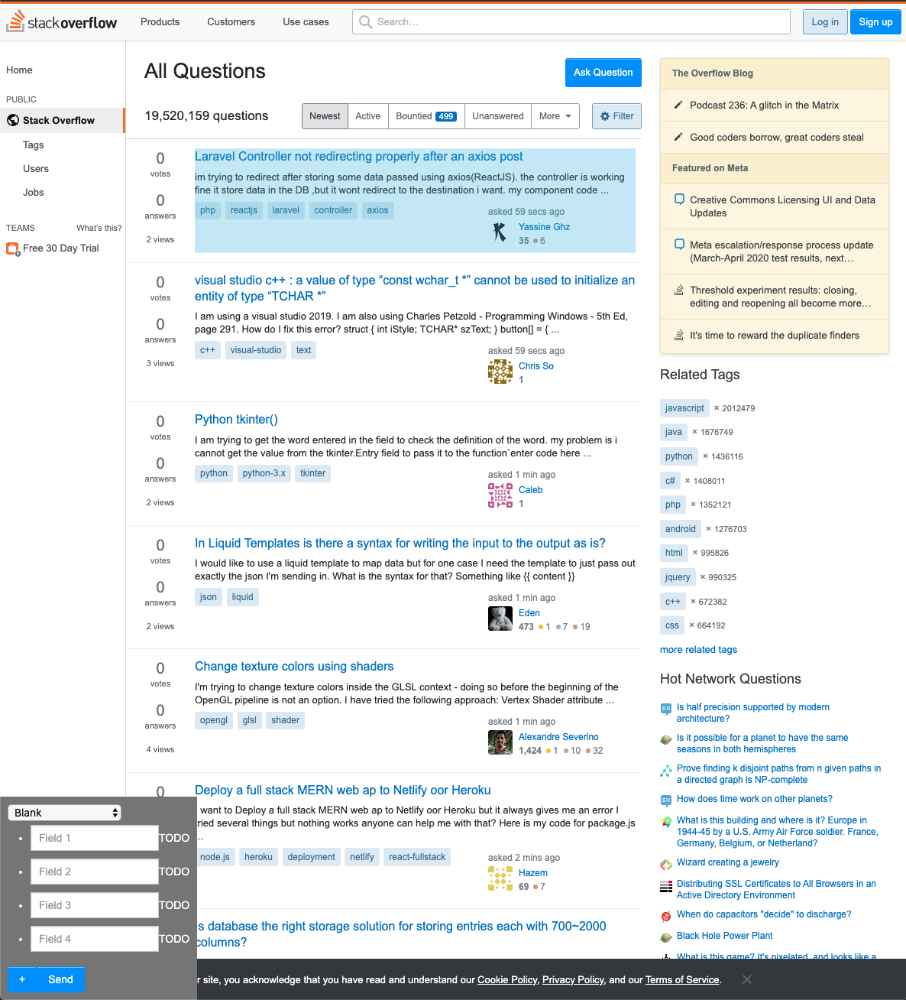
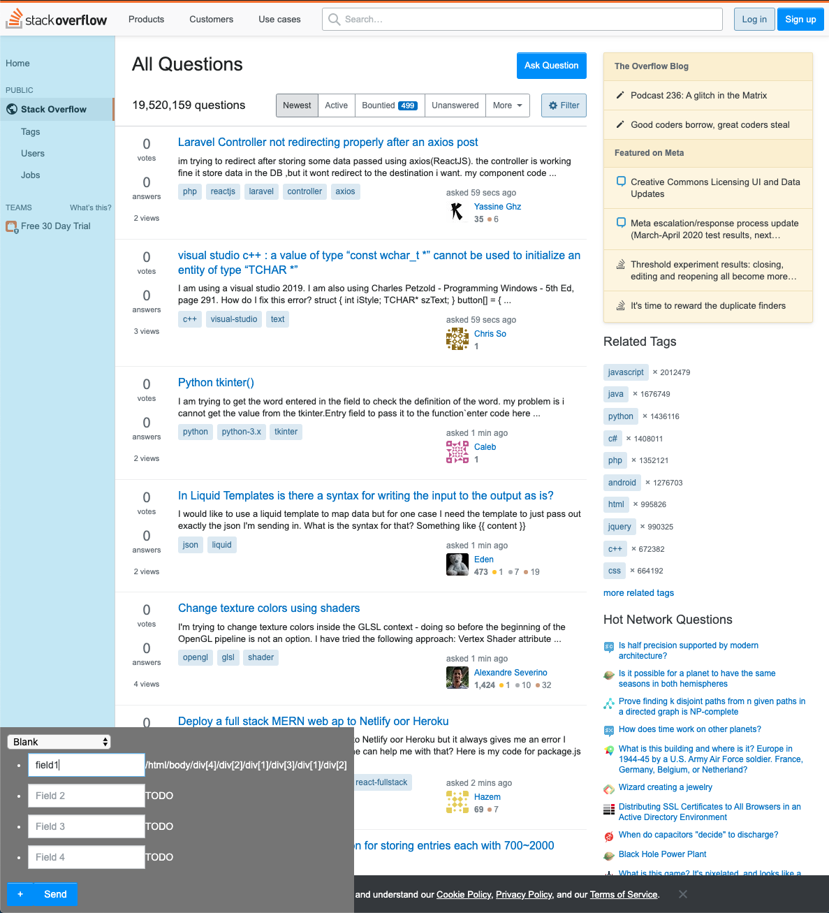
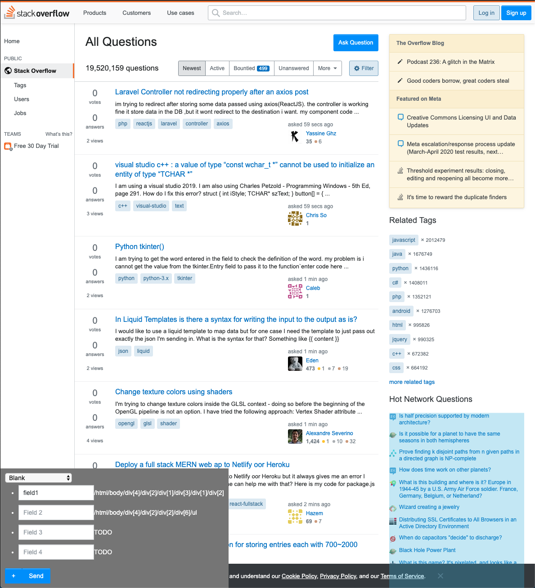
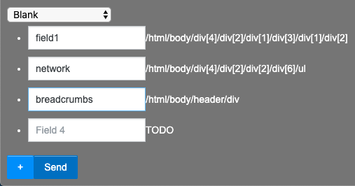

# Web Page Annotation Toolkit

A significant number of databases are exposed over the internet via dynamic web pages. It is of significant interest to automatically recreate the schema and the contents
of these databases or simply to be able to automatically parse web pages for other reasons. We can leverage a browser extension to simplify a critical and difficult step in this automation process, the annotation, enabling training set creation. We provide end-to-end tooling, consisting of a browser extension and server, for acquiring and recording annotations in json-formatted files. Tests show that the tool is a marked improvement over other methods in recording and acquiring schema and content from a variety of verticals, such as ecommerce, question-answering, etc..

## Table of Contents

* [Background](#background)
* [Dependency](#dependency)
* [Execution](#execution)

### Background

Almost all prior work in web page understanding depends on two primitives: (i) an initial segmentation that reflects the underlying separation among the rendered pieces of content (for instance the header, footer, main area, list of links, etc.), and (ii) further mapping of the content into a predefined schema. We believe that we can obtain good accuracy with a 2-pronged approach: (i) an initial unsupervised or supervised step to retrieve a semantic segmentation and (ii) a supervised method that is able to map records to a schema. Supervision is needed for the second step since it is not feasible a priori with no annotations to identify what underlying taxonomy is used to represent content. For instance, dollar amounts on a webpage can be (i) actual price of an item, (ii) price before a discount is applied, or (iii) variable names in a language such as Perl.

First we considered the segmentation step. An ideal solution would be able to perform this in an unsupervised manner. We had the idea of employing a landmark identification method for discovering salient keypoints. The technique in question has achieved high accuracy in domains such as (i) facial keypoint detection and (ii) pose estimation with no annotations. Once a set of landmarks (keypoints) is identified for a screenshot of a document/webpage, this could serve as the skeleton around which addition records are present. The unsupervised method yields a semantic segmentation where individual records are identified and extracted. 

A subsequent step would be to then pass the segmented output and the original image through an annotation step to identify what content items are significant for the target schema. Once annotated, the semantic segmentation step’s combined with the content (HTML or raw text) can be passed to a deep learning model that then performs the final prediction. Note that in the absence of content, any model will have to learn an additional optical character recognition (OCR). Evidence from suggests that observing the raw underlying HTML is a useful signal as opposed to just the text.

Next, we first discuss the landmark extraction technique we conceived, then describe a supervised alternative, and lastly describe tooling.


**Unsupervised Landmark Extraction**

The technique discussed here can be extended to a variety of document layouts owing to the unsupervised nature of the segmentation step. For instance, identifying the landmarks in a pdf can yield regions that can be used for subsequent OCR as opposed to running OCR on the whole page (which can yield incorrect results in a multi-column document).

The model passes a given input image through a strict bottleneck designed to capture the structure of the input. The bottleneck, or constraint, is a set of K heatmaps. Keypoint locations are extracted from these heatmaps and stacked alongside image features. This set of features and keypoints is then used to synthesize the target. The resulting heatmaps, and thus the keypoints, correspond to pose, and facial landmarks in the relevant datasets used. In a document analysis setting, the heatmaps ideally correspond to salient semantically linked regions of the document (i.e. one heatmap identifies the header, the other the footer and so on). The image features mentioned above are extracted from a pretrained neural network like VGG.


**Supervised Segmentation**

While less ideal from an operational standpoint due to needing more human effort, the segmentation problem can also be modeled as a supervised semantic segmentation task. Using a screenshot of the image as input, a model would return a set of regions in the page that are of interest. The actual content itself can be extracted by processing the HTML, identifying the components of the HTML that overlap the most with the predicted regions and then reading out the text from that region. Several popular models exist for semantic segmentation. Models from bounding box detection are also applicable to this problem since records in web pages are rendered in a left to right and top-down fashion, the most likely shape of any target annotation is a rectangle. Several popular models exist for placing bounding boxes around target objects. From either task, the final step is to extract the appropriate HTML element within the predicted region which is trivial given the X, Y coordinates and the width and height of each element (easily obtainable from most web browsers).


**Training Data Tooling**

While attractive in many dimensions, we believe that the unsupervised approach as it stands may be limited to documents of limited complexity. We therefore focus on the supervised approach. In particular, the goal of the annotation step is to obtain reliable bounding boxes around the content items of interest in the document. After evaluating several options, we settled upon the idea of constructing a tool that can run within a browser. This will allow human annotators to select bounding boxes and assign them to known schema or attach custom labels.

**Extension Notes**

We extend the MIT licensed `xpath-finder` for this project. See [LICENSE](LICENSE) for details.

We overcame various issues in constructing our tool. For one thing, page geometry affects extension complexity. Page geometry is altered by (i) late firing Javascript that alters said geometry and (ii) extensions that alter the page in various ways by hiding or removing objects. The latter in particular causes small variations in geometry that cause tool highlights or other aids to be rendered a little distance away from the desired location on a page.

The extension then uses a click event to put together a descriptive path or location. This path includes a variety of attributes deemed necessary (tag names, the element's unique id if available, the CSS class used, etc.). When the geometry is altered in particular ways these descriptive paths become invalid and the entire annotation is wasted. We partly alleviate this issue by waiting a few milliseconds on pageload - Javascript does not provide other ways of discovering if the page load is complete. Pages altered after annotation has begun are handled using the user interface—the annotator can undo actions and redo them. In addition, the annotations bundle element location information. Final annotations are also resolved using this location information (fairly accurate unless the page is changed too dramatically). The user interface also freezes scrolling and prevents clicks from continuing to the webpage underneath to prevent any annotator-introduced issues. In addition, our extension's controls are injected into the page's own markup. The element positioning in the page hierarchy is done to ensure it does not conflict with the rest of the page or alter the annotations. 

Chrome extensions intentionally limit the full range of abilities available in a typical web environment for security reasons. We managed to create a tool that merges in-page behavior with the rest of the Chrome extension machinery. This is not unique, but we believe it is far more efficient than any publicly available annotation tool.

In initial benchmarking, we found the user time was too slow because it took too long to click every single element and label every single element. We therefore modified the tool to allow a user to select a schema with a dropdown, have fields pre-filled with (editable) labels and then click multiple DOM elements to correspond to a selected field. These improvements result in a vast improvement to labeling time. 

# Dependency

Python 2 is required for the server.

The extension is targeted at the [Google Chrome Web Browser](https://www.google.com/chrome/).

# Execution

This module needs to be installed as an upacked extension inside Google Chrome. Detailed instructions are available at this [URL](https://stackoverflow.com/a/24577660).

Adding this extenion causes this icon to appear in the Chromium toolbar:


The extension requires a working web-server that can process the sent annotations. We bundle such a server in `server.py`.

It can be run using:

```
python2 server.py HOSTNAME PORTNO
```

For example:

```
(base) ➜  wpa git:(master) ✗ python2 server.py localhost 8000
Running at http://localhost:8000
Starting httpd...
```

The above command runs a server at [http://localhost:8000](http://localhost:8000). The extension expects the server to run at this URL.

A sample workflow is shown below:



This is the initial screen. The annotations are recorded in the bottom left.

we first annotate the questions:



Hovering on an element highlights it. A click records an XPath:



We can annotate multiple elements and use the `+` button to bring up additional fields.



Finally, clicking the send icon dispatches the annotation information the server.



The dispatched information is a json blob in the following format:

```
{
    "url": #The url of the webpage being annotated,
    "fields": #field names and XPATH queries as key-value pairs,
    "data": [
        #an array consisting of the browser configuration - i.e. the width, height, and the scrollbar positions.,
    ],
    "screenshots": #a base64 encoded image string containing a screenshot of the web browser viewport.
}
```

Thus the captured payload allows us to fully recreate the visual viewport of the annotator.

The sent payload is saved as a unique json file as-is on the server's file system for later inspection. An example json file is provided at [00d16c3b-7c0a-4323-9bad-965cb5d9a5bc.json](00d16c3b-7c0a-4323-9bad-965cb5d9a5bc.json).